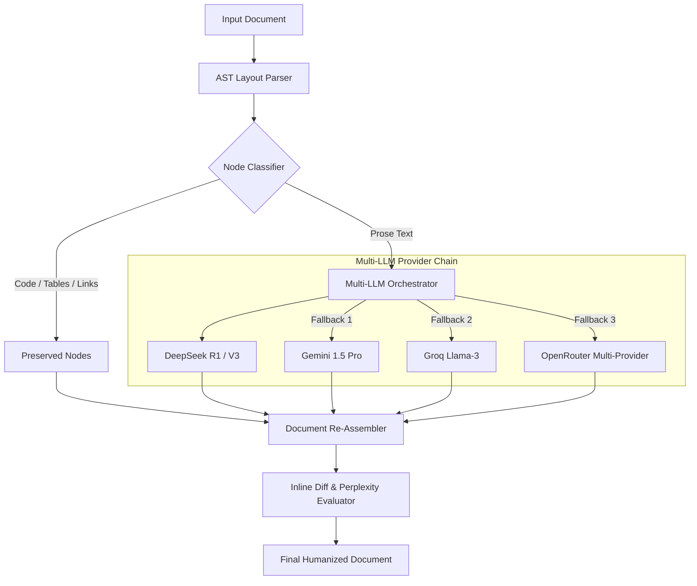

# Humanizer AI Engine 🤖✨

> **Advanced Layout-Preserving Multi-LLM Text Humanizer Engine**  
> *Architected for high-fidelity prose rewrite, multi-provider LLM fallback orchestration, and structure-preserving AST parsing.*

[](https://python.org)
[](https://fastapi.tiangolo.com)
[](LICENSE)

---

## 💡 Overview

**Humanizer AI Engine** is an enterprise-grade text transformation engine engineered to rewrite AI-generated prose into natural, human-grade text while guaranteeing **100% preservation of document structure**. 

Unlike standard text rewrite tools that destroy Markdown syntax, code blocks, lists, and tables, Humanizer AI parses input documents into an Abstract Syntax Tree (AST), isolates prose nodes for LLM rewriting, and re-assembles the document deterministically.

---

## 🏗️ Architecture



---

## 🚀 Key Features

- 🛡️ **Zero Layout Destruction**: Preserves raw Markdown, fenced code blocks (`python`, `js`, etc.), tables, LaTeX, and nested bullet points.
- ⚡ **Multi-LLM Fallback Orchestration**: Seamless fallback across **DeepSeek R1/V3**, **Gemini 1.5 Pro**, **Groq**, and **OpenRouter** to maintain 99.9% uptime.
- 📊 **Perplexity & Readability Analytics**: Evaluates burstiness, vocabulary variation, and perplexity scores before and after rewriting.
- 🔍 **Visual Inline Diff Viewer**: Built-in diff comparison engine highlights exact text modifications and stylistic shifts.
- 🚀 **High-Performance Async API**: Built on FastAPI with Pydantic validation, background job tracking, and SQLite/PostgreSQL persistence.

---

## 🛠️ Tech Stack

- **Backend**: FastAPI, Uvicorn, Pydantic, SQLAlchemy, Asyncio
- **LLM Integrations**: DeepSeek API, Google Gemini API, Groq SDK, OpenRouter Client
- **Data & Storage**: SQLite / PostgreSQL, Alembic
- **Testing & Quality**: Pytest, Pre-flight validation scripts

---

## 📦 Getting Started

### 1. Prerequisites
- Python 3.11 or higher
- Git

### 2. Installation & Setup
```bash
# Clone repository
git clone https://github.com/nabaraj-kc/Humanizer-AI-Engine.git
cd Humanizer-AI-Engine

# Create virtual environment
python -m venv .venv
source .venv/bin/activate  # On Windows: .venv\Scripts\activate

# Install dependencies
pip install -r requirements.txt
```

### 3. Environment Configuration
Copy the example environment template and populate your API credentials:
```bash
cp .env.example .env
```

### 4. Run the Engine
```bash
python main.py
# Server starts at http://localhost:8000
# OpenAPI Docs available at http://localhost:8000/docs
```

---

## 👨‍💻 Author

**Nabaraj KC**  
- GitHub: [@nabaraj-kc](https://github.com/nabaraj-kc)  
- Portfolio: [nabarajkc.com.np](https://nabarajkc.com.np)
